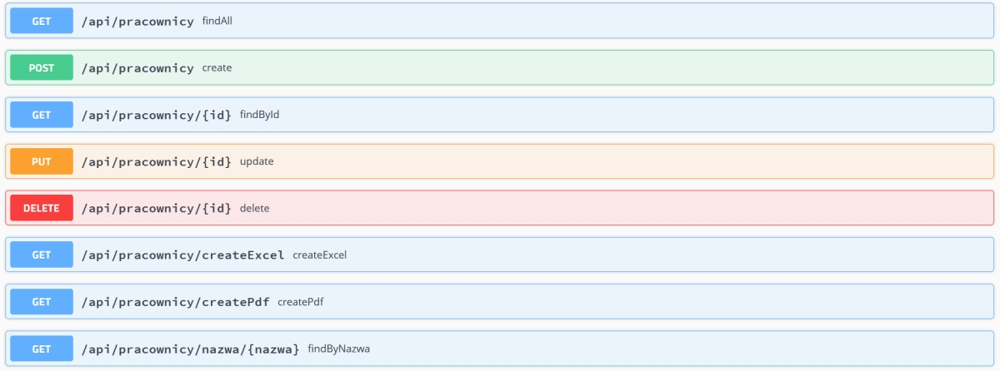

# Pracownicy REST

Application to management the employee database. HTTP endpoints using the GET, POST, PUT and DELETE methods allow data manipulation (creating, viewing, modifying and deleting - [CRUD](https://en.wikipedia.org/wiki/Create,_read,_update_and_delete))
employees in the base. The application can generate PDF or XLS employee summary.

The application logger is configured in the `application.properties` file, allows you to select the login level for each part of the application, available login levels: OFF, ERROR, WARN, INFO, DEBUG, TRACE.

API documentation on http://localhost:8080/swagger-ui.html



## Technologies

* [Java 8](https://www.java.com/)
* [Spring Boot 2](https://spring.io/)
* [Maven](https://maven.apache.org/)
* [Lombok](https://projectlombok.org/)
* [Swagger](https://swagger.io/)
* [Thymeleaf](https://www.thymeleaf.org/)
* [SLF4J](http://www.slf4j.org/) & [LOGBack](http://logback.qos.ch/)
* [Apache Commons Lang](http://commons.apache.org/proper/commons-lang/)
* [JUnit](https://junit.org/junit5/) & [AssertJ](https://joel-costigliola.github.io/assertj/)
* [REST-assured](http://rest-assured.io/)
* [Apache POI](https://poi.apache.org/)
* [iText PDF](https://itextpdf.com/)
* `.gitignore` file created by [gitignore.io](https://www.gitignore.io)

## Running

```
	$ ./mvnw spring-boot:run
```

or

```
	$ ./mvnw clean package	
```

```
	$ ./java -jar target/pracownicy-1.0.0.jar	
```

***

# Pracownicy REST

Aplikacja umożliwia zarządzanie bazą pracowników. Wystawione endpointy HTTP przy pomocy metod GET, POST, PUT oraz DELETE umożliwiają manipulowanie danymi (tworzenie, przeglądanie, modyfikację i usuwanie - [CRUD](https://pl.wikipedia.org/wiki/CRUD)) 
pracowników w bazie. Aplikacja umożliwia generowanie zestawień do plików PDF oraz XLS.

Logger aplikacji konfigurowany jest w pliku `application.properties`, umożliwia wybór poziomu logowania dla każdej z części aplikacji, dostępne poziomy logowania: OFF, ERROR, WARN, INFO, DEBUG, TRACE.

Dokumentacja interfejsu API pod adresem http://localhost:8080/swagger-ui.html


## Użyte technologie

* [Java 8](https://www.java.com/)
* [Spring Boot 2](https://spring.io/)
* [Maven](https://maven.apache.org/)
* [Lombok](https://projectlombok.org/)
* [Swagger](https://swagger.io/)
* [Thymeleaf](https://www.thymeleaf.org/)
* [SLF4J](http://www.slf4j.org/) & [LOGBack](http://logback.qos.ch/)
* [Apache Commons Lang](http://commons.apache.org/proper/commons-lang/)
* [JUnit](https://junit.org/junit5/) & [AssertJ](https://joel-costigliola.github.io/assertj/)
* [REST-assured](http://rest-assured.io/)
* [Apache POI](https://poi.apache.org/)
* [iText PDF](https://itextpdf.com/)
* Plik `.gitignore` wygenerowano przy pomocy witryny [gitignore.io](https://www.gitignore.io)

## Uruchamianie

```
	$ ./mvnw spring-boot:run
```

lub

```
	$ ./mvnw clean package	
```

```
	$ ./java -jar target/pracownicy-1.0.0.jar	
```
